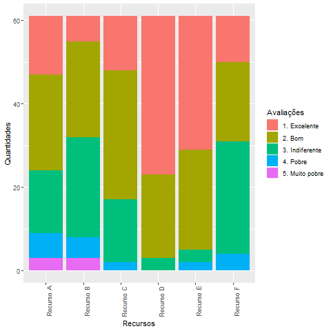

```{r setup, include=FALSE}
knitr::opts_chunk$set(echo = TRUE)
```

## Como os entrevistados avaliam os recursos das plataformas de mídias sociais no contexto acadêmico?

<span style="font-size: 11pt;">
Foram considerados os seguintes recursos:<br>
<strong>A.</strong>	Envio de informações da escola para os pais.<br>
<strong>B.</strong>	Um número crescente de instituições educacionais está usando mídias sociais por motivos promocionais.<br>
<strong>C.</strong>	As escolas estão começando a usar grupos no Facebook para se comunicar com os alunos.<br>
<strong>D.</strong>	Os membros dos grupos podem trocar arquivos, links, informações, pesquisas e vídeos rapidamente. Quando alguém contribui com o grupo, seus membros recebem uma notificação. Se for utilizado o aplicativo Facebook para smartphone, estas trocas são enviadas diretamente para o dispositivo móvel dos alunos.<br>
<strong>E.</strong>	Estudantes e professores podem compartilhar informações entre si.<br>
<strong>F.</strong>	O aplicativo “Pinterest" está se tornando popular como um "quadro virtual". O App permite compartilhar, carregar, classificar e gerenciar imagens, vídeos e outros conteúdos multimídia. É ótimo para compartilhar recursos da internet que os alunos acharem interessantes ou relevantes.
</span>


***
<span style="display: block;
    margin-left: auto;
    margin-right: auto;
    width: 50%;">
{width=250px}
</span>


***
Observando o gráfico que contabiliza as respostas, podemos observar que:

- Na média os recursos foram considerados bons;
- O recurso que foi melhor avaliado, obtendo o maior número de “Excelente” e nenhum “Pobre” ou “Muito pobre”, foi do aplicativo Facebook que disponibiliza a ferramenta de criação de grupos para compartilhamento de informações;
- A troca de informações escolares com os pais, bem como o número crescente de instituições estarem utilizando as plataformas sociais como meios de promoção, foram os recursos que mais obtiveram classificações ruins, com os maiores números de “Muito pobre”;
- Sobre o recurso do aplicativo Pinterest, foi o que mais obteve a classificação “Indiferente”, sendo inclusive o maior número dentre as categorias em que foi avaliado.
